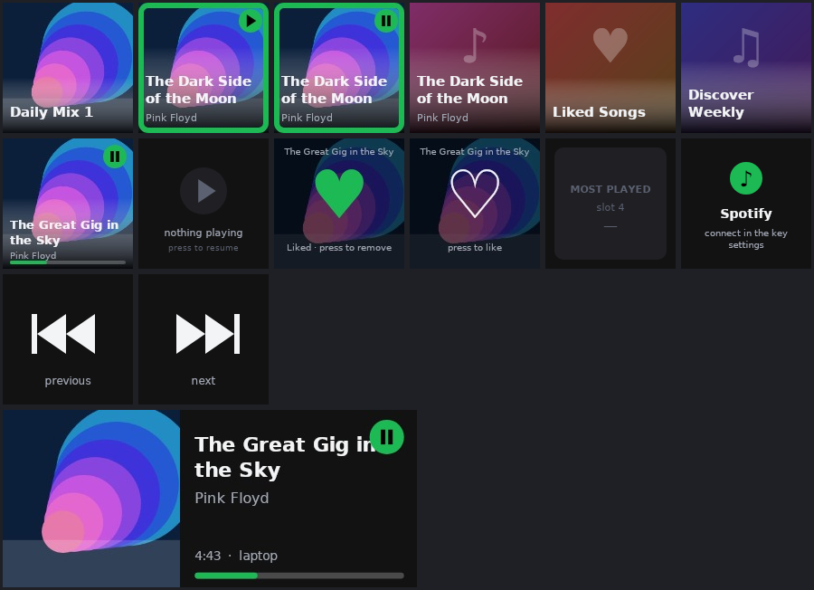

# Spotify Music Picker — OpenDeck plugin

A whole-deck Spotify layout for a stream deck under [OpenDeck](https://github.com/nekename/OpenDeck), built for
the Ulanzi D200X (5×3 keys, a double-width screen, two side buttons, three dials) and usable on any OpenDeck device:

- **Row 1 — Made for you**: the playlists Spotify generates for you (Daily Mix 1–6, daylist, Discover Weekly,
  Release Radar, On Repeat…), with their covers.
- **Row 2 — Most played**: the albums and playlists you actually play most, ranked from your own listening
  history (Spotify has no play counts, so the plugin keeps one: recency-weighted, 30 days by default), with a
  cold start from your top tracks.
- **Row 3 — Suggested**: three albums picked for you — albums you saved but have not played lately, and the
  catalogues of your top and followed artists — new picks every day, or on a dial press.
- **Wide screen — Now playing**: cover, track, artist, progress, volume; press = play / pause. Square keys get a
  square version.
- **Side buttons**: previous / next song.
- **Left dial**: Spotify volume; **press = switch between your main layout and the Spotify layout** (and back).
  The right dial is whatever you already have there (the profile generator copies it from your main layout).
- **Third dial**: scroll the first two rows (they hold more than five items); press = new suggestions.

Press any cover to play it — on the active Spotify device, else on this computer's Spotify (falls back to MPRIS for
the local client). A green frame marks what is playing.



**Scope**: Linux only. Tested with OpenDeck 2.14 on KDE Plasma 6 with an Ulanzi D200X (through the
[opendeck-ulanzi-d200x](https://github.com/edubox/opendeck-ulanzi-d200x) device plugin ≥ 1.3 for the wide
screen). Needs a Spotify **Premium** account (Spotify requires it for Development Mode apps since February 2026).

## What Spotify still lets an app see (2026)

Spotify's API rules changed twice (November 2024, February 2026) and this plugin is built on what is left:

| Row | Source |
|---|---|
| Made for you | `GET /me/playlists`, playlists owned by `spotify`. Apps created after 27 Nov 2024 without a quota extension do not get them (they are omitted or `null`, in search too — verified). Then: paste their share links in the settings (*Made-for-you links*, one per line, optional name after `\|`). Playback still works; the cover is learned from the songs you play from it. A mix you play in the Spotify app also appears by itself (its context URI is in the play history; Spotify refuses its name, so it is "Spotify mix" until you name it). |
| Most played | `GET /me/player/recently-played` polled every few minutes into a local history (`~/.local/share/opendeck-spotifymusicpicker/history.json`); `GET /me/top/tracks` while the history is short |
| Suggested | `GET /me/albums` (saved albums not played lately), `GET /me/top/artists` + `GET /me/following` → `GET /artists/{id}/albums`; `/recommendations`, `/browse/new-releases` and `related-artists` are gone |
| Now playing / transport / volume | the player endpoints (`/me/player…`), `playerctl -p spotify` as fallback |
| Covers | `GET /albums/{id}`, `GET /playlists/{id}` (batch endpoints were removed, so results are cached on disk) |
| Layout switch (dial press) | plugins may not send `switchProfile` over the socket, so the message is handed to the running OpenDeck through its single-instance D-Bus hook (`busctl … org.SingleInstance.DBus ExecuteCallback`, a few ms); `opendeck --process-message` (~300 ms) is the fallback |

Nothing is sent anywhere but api.spotify.com; the OAuth tokens live in `~/.local/share/opendeck-spotifymusicpicker/tokens.json` (mode 600).

## Build & install

**From a release**: download `com.josbol.spotifymusicpicker.sdPlugin-<version>.zip` from the GitHub releases page and
use OpenDeck → Plugins → *Install from file* (self-contained x64 and arm64 binaries; no .NET needed).

**From source**: .NET 10 SDK, `playerctl` (optional MPRIS fallback), OpenDeck ≥ 2.x with **developer mode** on if
you install as a symlink.

```sh
./scripts/build.sh              # dotnet publish → plugin/com.josbol.spotifymusicpicker.sdPlugin/bin/linux-x64
./scripts/package.sh            # both architectures → dist/com.josbol.spotifymusicpicker.sdPlugin-<version>.zip
./scripts/install.sh --link     # symlink into ~/.config/opendeck/plugins (or plain ./scripts/install.sh to copy)
./scripts/install-profile.py    # creates the "Spotify" profile for the Ulanzi D200X (see below)
./scripts/install-profile.py --main-dial 0    # …and makes dial 0 of "Default" the Spotify volume dial whose press opens the Spotify layout
```

### Connecting to Spotify

1. Create an app at <https://developer.spotify.com/dashboard> (Web API; Development Mode; the owner needs Premium).
   Add the redirect URI **`http://127.0.0.1:43118/callback`** (Spotify refuses `localhost`; change the port in the
   settings if 43118 is taken). If you already run *Essentials for Spotify*, the plugin borrows its (public) client
   id — just add the redirect URI to that app.
2. Open the property inspector of any Spotify Music Picker key → *Plugin-wide settings* → paste the **Client id**
   → **Connect to Spotify**. The browser opens Spotify's consent page (PKCE, no secret); the plugin listens on
   127.0.0.1 for the redirect and stores the tokens.
   Without a browser on the machine: `opendeck-spotifymusicpicker --login <client id>` prints the URL.
3. The rows fill in a few seconds. Made for you empty? On a new app it will be: paste the playlists' share links
   (Spotify app → *Made For You* → playlist → ⋯ → Share → Copy link) into *Made-for-you links*, one per line, e.g.
   `https://open.spotify.com/playlist/37i9dQZF1E3…?si=… | Daily Mix 1`. The ids of Daily Mix 1–6, Discover Weekly,
   Release Radar and daylist are stable for your account, so this is a one-time paste.

### The "Spotify" profile (D200X)

```
 row 0 │ Made for you 1 │ 2 │ 3 │ 4 │ 5
 row 1 │ Most played 1  │ 2 │ 3 │ 4 │ 5
 row 2 │ Suggested 1 │ 2 │ 3 │ Now playing (wide screen) │ D200X "Wide screen" action (copied from Default)
 dials │ 0: Spotify volume, press → back to Default │ 1: copied from Default (e.g. PipeWire volume) │ 2: browse / new suggestions
 side  │ 1: previous track │ 2: next track
```

OpenDeck squeezes every key into a 144×144 image before it reaches a device plugin, so the wide now-playing image
is composed at 2:1 and squeezed to a square; the D200X plugin (≥ 1.3) expands it again when its **Wide screen**
action on this layout is set to *Action icon* with fit *Stretch* — `install-profile.py` writes exactly that into the
copied action (`--wide-mode`, `--wide-fit`), so the Default layout keeps its clock / system monitor and the Spotify
layout shows the music.

Switching layouts is quick because OpenDeck keeps the last image of every key: the plugin remembers what it sent and
does not send it again on re-appear, so OpenDeck's renderer draws each key once; photo keys travel as JPEG.

OpenDeck keeps loaded profiles in memory and writes them back to disk when it exits, so to change a profile it
already knows (`--main-dial`): **stop OpenDeck, run `install-profile.py`, start OpenDeck** (a new, never-selected
profile is picked up without a restart).

## Diagnostics

```sh
BIN=plugin/com.josbol.spotifymusicpicker.sdPlugin/bin/linux-x64/opendeck-spotifymusicpicker
$BIN --probe               # which endpoints your app may call (and how many playlists Spotify hides from it)
$BIN --dump                # the three rows + playback as JSON, with the reason each item is there
$BIN --play <uri or link>  # start something, same path the keys use
$BIN --render out/         # PNGs of every key style (no network)
$BIN --login [clientId] [port] / --logout
SPOTIFYMUSICPICKER_DEBUG=1 …   # verbose event log
dotnet test                # unit tests + an in-process fake Spotify API and fake OpenDeck socket
```

Plugin log: `~/.local/share/opendeck/logs/plugins/com.josbol.spotifymusicpicker.sdPlugin.log`.

## Settings

Per key: row (Made for you / Most played / Suggested) and slot; now-playing layout (square / wide); dial press target
(Spotify layout / main layout / play-pause) and volume step; browse dial rows.

Plugin-wide (any property inspector → *Plugin-wide settings*): client id and callback port, the two profile names,
made-for-you links, history window (days), names on covers, preferred playback device, volume step, now-playing
poll interval, rows refresh interval.

## Layout of the code

```
src/Opendeck.SpotifyMusicPicker/
  Deck/        DeckClient (WebSocket protocol), DeckEvent
  Spotify/     SpotifyAuth (PKCE + loopback redirect + token file), SpotifyClient (typed calls, 401/429 handling), Model
  Picker/      PlayHistory (local plays, ranking), MadeForYou (detection, link parsing), Recommender, MetadataCache, ArtCache,
               LocalPlayer (playerctl), Curator (builds the rows, tracks playback, plays)
  Actions/     PluginHost (event routing, rendering, profile switch), one class per action, GlobalSettings
  Rendering/   KeyRenderer (SkiaSharp: covers, tiles, now playing square + wide, transport glyphs)
plugin/com.josbol.spotifymusicpicker.sdPlugin/   manifest, icons, property inspectors, fonts (+ bin/ after build)
tests/Opendeck.SpotifyMusicPicker.Tests/          xunit: parsing, ranking, PKCE, recommender + FakeSpotify / FakeOpenDeck end-to-end
scripts/     build.sh, package.sh, install.sh, install-profile.py, make-icons.py, render-docs.sh
```
